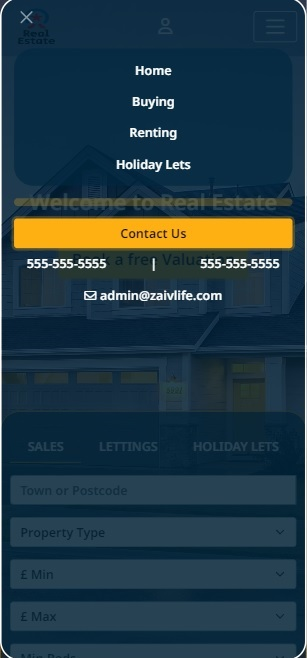

# Zai Real Estate

Welcome, this project is 
this project is a real estate platform with buying options.

See this project on live enviroment on Heroku here: <https://estate-agency-website.herokuapp.com/>

### User Stories

As a visitator:

- I want to see properties and clear details about it.
- I want to be able to acces website using any device.
- I want to be able to buy and pay rent securely.
- I want to be able to create an account.
- I want to be able to be able to see past payments.

As a shop owner:

- I want to be able to add properties.
- I want to be able to edit, delete properties.
- I want to make a good impresion.
- I want to colect payments fast and secure.

## Features

Click To Expand Features

### Navigation

- Same navigation menu is used across all pages for consistency, navbar is fully responsive on all devices.  Log out button will show only to autentificated users and liddle man icon button will open login-register form if user is not autentificated and if is the will redirect to profile page.

- Autentificated:

- Navigation was designed to be easy to use and to understand.

- Mobile Navbar

- Mobile Navbar Expanded

- Mobile Navbar Autentificated

- Navigation was designed to work well on all devices.

### Index Screen

Index Screen was designed with 3 main sections:

#### Hero-search section:

- Hero Search Desktop:

- Hero Search Tablet:

- Hero Search Tablet:

#### Index Welcome section:

- Index Welcome Desktop:

- Index Welcome Tablet:

- Index Welcome Tablet:

#### Index Showroom section:

- About the presentation of the product. We can point that is complatly dinamic, in top will show messages as: Available, Available from, Sold, Rented, And no message at all if is not set web you add the product. Buy Button will change: Buy Now, Rent Now, Book Now as needed from product category. And if is sold or rented then will go away and only contact button will be showd.  This spot will accomodate a maximum of 8 cards.

- Index Showroom  Desktop:

- Index Showroom  Tablet:

- Index Showroom  Tablet:

